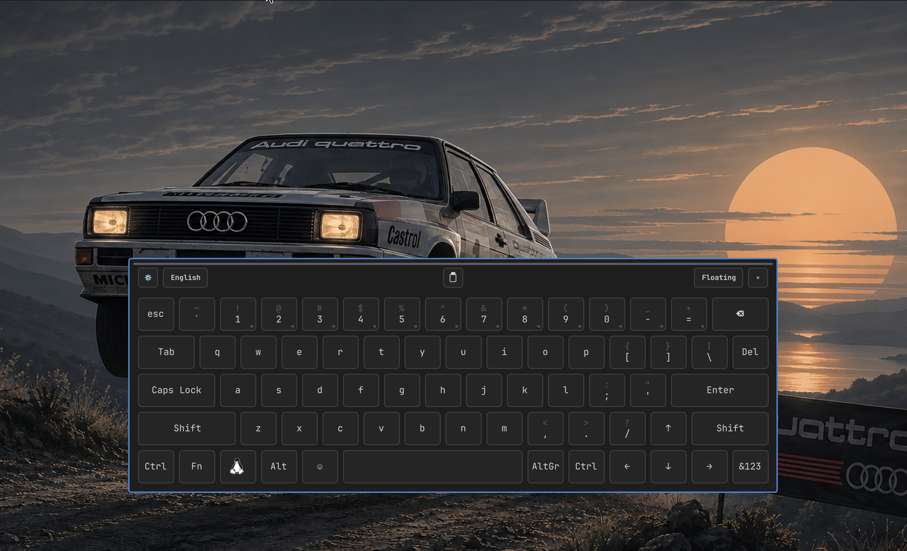
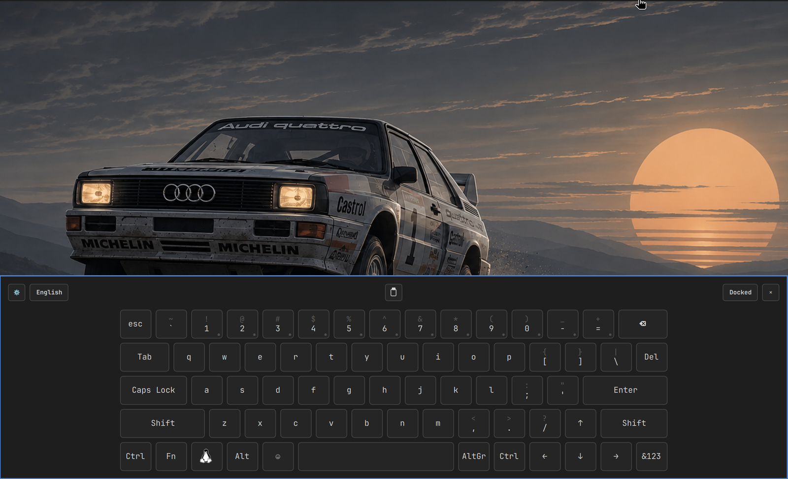
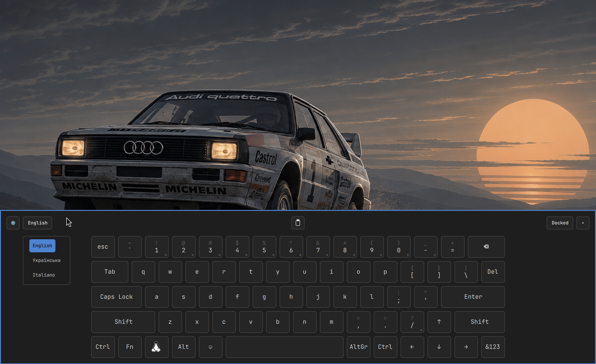
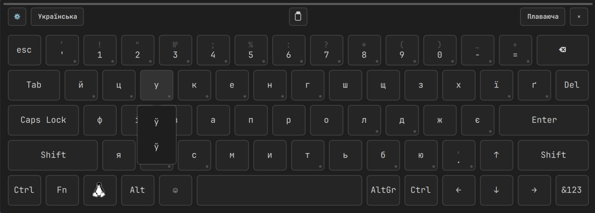
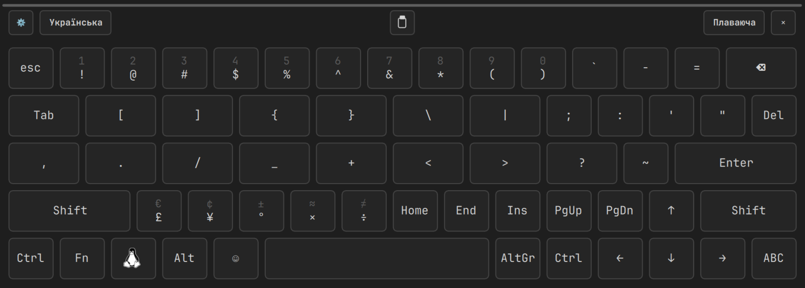
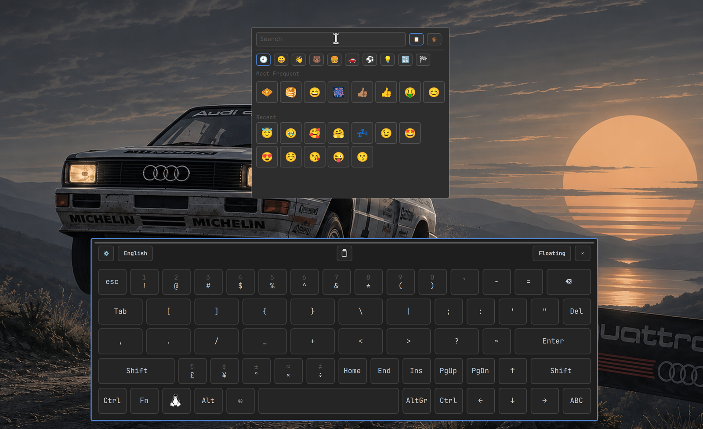
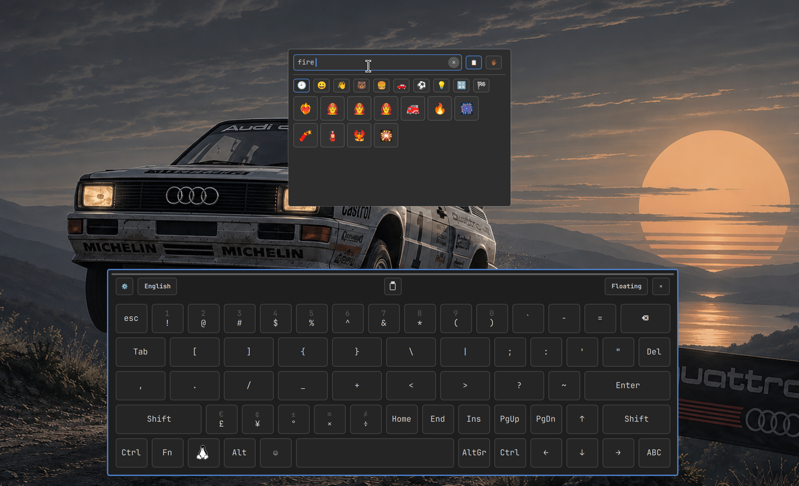
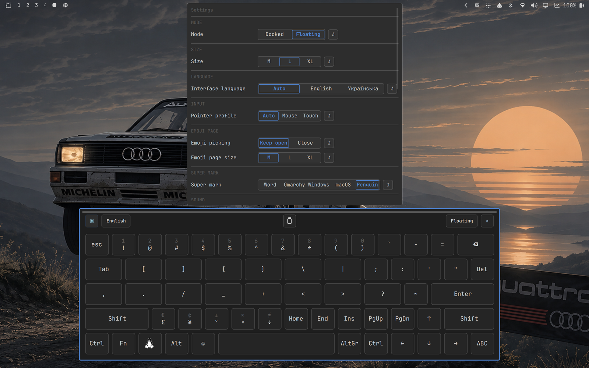
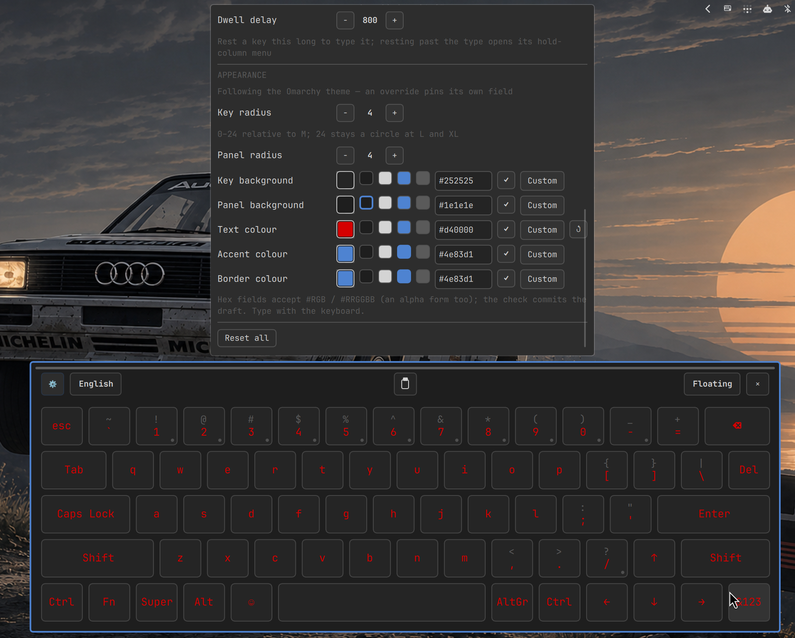

# OSKar — on-screen keyboard for Omarchy

OSKar (say it "OS-car", Оскар in Cyrillic) is a mouse-driven on-screen
keyboard for Omarchy Quattro. OSKar is not Oscar — no statuettes; it's
the OSK, ar. The key caps follow the active keyboard layout, so what is
drawn is what gets typed, and the panel takes its colours and geometry
from the Omarchy theme.

<p align="center">
  
</p>

## Screenshots

| | |
|---|---|
|  <br>**Docked** — flush along the bottom edge, full width |  <br>**Caps follow the seat** — Ukrainian drawn and named Українська |
|  <br>**Languages named in their own language** — English, Українська, Italiano; picking one moves the whole seat |  <br>**Hold a key** — its extra levels stack into a column (Ukrainian н: ŷ) |
|  <br>**?123 symbols** — currency and punctuation on every layout |  <br>**Emoji page** — categories, recents, the panel's own grid |
|  <br>**Emoji search** — type a query, pick from the matches |  <br>**Settings** — mode, size, interface language, input profile |
|  <br>**Appearance** — radius and colours, applied live | |

## Status

Alpha, daily-driven by its author on his own machine — that is how most
of it was found and fixed. **0.1.0 is the first release.** It installs
through Omarchy's plugin manager, from a source checkout, or from the
release with its `PKGBUILD` and a prebuilt helper (all below).
[CHANGELOG.md](CHANGELOG.md) lists what works; `docs/decisions.md`
explains why it works that way.

## Layout

| path | what it is |
|---|---|
| `manifest.json` | plugin manifest (`io.github.vladkarok.oskar`) |
| `Panel.qml` | the keyboard window: a docked full-width strip or a floating overlay |
| `Keyboard.qml` + the extracted seams (`HelperLink.qml`, `PasteChords.qml`, `HoldMenu.qml`) | key grid, layout tracking, reply dispatch, keycap pipeline; the socket client and paste chords live in their seams (§105–§106) |
| `KeyboardLayout.js` | key rows, keysym tables, xkb position mapping |
| `EmojiPage.qml`, `EmojiCatalog.js` | the panel's own emoji page over the keys; catalogue generated from vendored Unicode data (`third_party/emoji/`) |
| `ClipboardPaste.js` | the emoji delivery transaction and the paste chip's target rule (colour field, emoji search, external client) |
| `ChordAcks.js` | reply correlation: every command one queue slot, every reply pops it — the paste chord's verdict is its own final line's ack |
| `PasteFlow.js` | the paste lifecycle: busy-gate, dispatch region, ordered cancellation |
| `ShareQueue.js` | the keymap-share scheduler: one share run at a time, the pending generation consumed on success |
| `LanguageControl.js` | the language control's shapes and the chooser's entries; languages named in their own language |
| `LayoutDevices.js` | which keyboard the panel reads its layout from, and which ones the language button moves |
| `SettleGuard.js` | the post-reconnect echo window: which uncommanded group flips to follow |
| `HoverTooltip.qml` | one shared hover tooltip for ambiguous icon controls |
| `ModifierReducer.js` | the modifier state machine (pure, tested) |
| `Config.js` | maintained defaults plus override/state validation and serialization |
| `Theme.qml` | the panel's one reader of Omarchy's shared style tokens |
| `BarWidget.qml` | bar icon that toggles the panel |
| `daemon/` | Rust helper holding one virtual keyboard |
| `tools/nested-session.sh` | runs a command against a throwaway nested Hyprland |
| `tools/smoke-daemon.sh` | end-to-end check of the helper |
| `tools/integration/` | the assertions that check runs, and their plumbing |
| `docs/orientation.md` | what this is and how the pieces fit — read first |
| `docs/decisions.md` | why the design looks like this, and the dead ends |
| `docs/vm-handoff.md` | the dogfooding VM: operating manual and queue |

## Modes and configuration

The panel has two geometries. **Docked** (the default on first run) sits
flush along the bottom edge at full width and reserves that space through
the layer-shell exclusive zone, so windows move up while it is open and
return when it closes — the way the Windows touch keyboard behaves. A
fullscreen window ignores exclusive zones and is overlaid instead. **Floating**
reserves nothing and is dragged by its bar. Mode is chosen in Settings.

Maintained defaults ship in `Config.js`. Deliberate user choices are sparse in
`$XDG_CONFIG_HOME/oskar/config.json`; floating geometry is separate in
`$XDG_STATE_HOME/oskar/state.json`. Both files reload on change without
polling and GUI writes replace them atomically. Invalid external text stays
untouched while the panel keeps the last valid runtime value.

| key | values | default |
|---|---|---|
| `mode` | `docked` \| `floating` | `docked` |
| `size_preset` | preset name | `medium` |
| `sound` | `true` \| `false` | `false` |
| `follow_theme` | `true` \| `false` | `true` |
| `emoji_close_after_pick` | `true` \| `false` | `false` |
| `emoji_drag` | `true` \| `false` | `false` — the page opens centred and still; on, it grows a drag strip and its position is remembered |
| `emoji_page_size` | `medium` \| `large` \| `x-large` | `medium` |
| `super_mark` | `word` \| `omarchy` \| `windows` \| `macos` \| `penguin` | `word` |
| `key_radius` | whole-pixel integer ≥ 0, 0–24 relative to M | `8` |
| `panel_radius` | whole-pixel integer ≥ 0 | `12` |
| `key_background` | hex colour (`#RGB`, `#RGBA`, `#RRGGBB`, `#AARRGGBB`) | `#303030` |
| `panel_background` | hex colour (`#RGB`, `#RGBA`, `#RRGGBB`, `#AARRGGBB`) | `#202020` |
| `text_color` | hex colour (`#RGB`, `#RGBA`, `#RRGGBB`, `#AARRGGBB`) | `#f5f5f5` |
| `accent_color` | hex colour (`#RGB`, `#RGBA`, `#RRGGBB`, `#AARRGGBB`) | `#7aa2f7` |
| `border_color` | hex colour (`#RGB`, `#RGBA`, `#RRGGBB`, `#AARRGGBB`) | `#5a5a5a` |

`state.json` contains the floating placement as `center` — the card centre in
output-local coordinates — or `null`, the emoji page's dragged position as
`emoji_center` (written when `emoji_drag` is on; kept across setting flips),
bounded emoji usage continuity, and the emoji skin-tone selection (state, not
an override).
Restores rederive
the top-left from that centre, clamped only enough to keep the complete card
on its output (the deterministic anchor of spec-v1.1 §4), so a saved
placement cannot jump near an edge when the preset or output changes. An
absent override follows the maintained value, so a later release can change
its default without rewriting the user's sparse file.

`sound: true` plays the freedesktop sound theme's `bell` event on each key
press through QtMultimedia — nothing is spawned per keystroke. It needs
`qt6-multimedia` and `ffmpeg`; the theme's Vorbis file is transcoded to PCM
once at startup (SoundEffect plays uncompressed WAV only), into
`$XDG_RUNTIME_DIR`. Without them the keyboard works and stays silent.
Colours, fonts and corner radius all come from the shared Omarchy style tokens,
so switching the theme redraws the keyboard where it stands — no restart of the
shell or the plugin, and nothing on the typing path is touched. `follow_theme:
false` stops it tracking theme changes: the keyboard keeps the theme that was in
force when it was first opened. Each of the seven appearance fields in the table
above can also be pinned on its own — the settings popover's Appearance section,
or a sparse entry in `config.json`: an explicit override wins over the theme for
that field alone, with precedence override → live (or frozen) token → shipped
default, while every unpinned field keeps following or staying frozen as
`follow_theme` says. Overrides are the whole of the v1.1 appearance surface, not
an independent colour schema — that remains v2.

## Input profile (mouse and touch)

**Touch is beta.** OSKar's design centre is the mouse; the touch
profile is new and usable but not yet polished — expect small targets
in the emoji and settings chrome. It is opt-in: the default profile is
Mouse, and nothing switches until you choose Auto or Touch in Settings.

One setting, three values (**Mouse** by default; **Auto** or **Touch**
opt in):

- **Mouse** (the design centre): hover tooltips everywhere,
  dwell-to-type (rest on a cap and it types — the accessibility
  slice), hold-a-key column menus, press-typing with the compositor's
  own key repeat.
- **Touch** re-answers what a finger cannot do: a touch cannot hover,
  so dwell never arms and tooltips show on touch-and-hold
  (gear/close/paste) or stay hidden where a label already states the
  thing; fingers drift, so character caps **type on release** and
  sliding off cancels; long-press opens the same hold-column menus
  (the mobile idiom); chrome hit areas grow toward comfortable size
  where the geometry allows; Space/BackSpace keep press semantics, so
  holding BackSpace repeats exactly as on a hardware keyboard, and
  the close cap answers a release like every character cap.
- **Auto** observes the pointer's source: the first touch-drawn event
  switches to the touch affordances **for that summon** (a hidden
  panel forgets), and the settings row says `Auto (touch)` while it
  stands — the manual Mouse pin is the deliberate escape. One guard
  is absolute: with **dwell enabled, auto never flips** — a chosen
  access method is not disarmed by a stray touch.

Known rough edges, named: the emoji group tabs and settings segments
remain small targets; pen input is untested (a pen receives the touch
affordances); the observation is panel-wide — a touch on one monitor
switches the caps on all of them until the panel hides. Touch is
proven against an emulated multitouch device end to end (evdev →
libinput → the compositor's wl_touch) and Qt's own touch synthesis on
the shipping Qt version; real-finger hardware has not been in our
hands yet.

## Security posture

One sentence: OSKar is a **same-user** tool. Everything it owns lives
under your `/run/user/<uid>/oskar/` and `~/.config/oskar/` with
`0700`/`0600` permissions, the daemon runs as your user without
privileges, and the control socket is connectable only by processes
running as you — other users on the machine cannot inject keystrokes
or read your keymap.

Honest edges: root can do what root always can (no same-user tool
draws that line); the daemon trusts its same-user callers on a line
protocol (the same-user trust boundary is documented in
SECURITY.md; there is no network listener, no telemetry, no accounts — the
vision document calls the product a system utility and means it.

## Languages

One product, four languages, each with a job:

- **QML** (the Quickshell panel) — what the panel is and where it draws.
- **JavaScript** (twenty pure modules beside the QML) — every decision
  the panel makes: what each keycap types, which modifiers a
  hold-column pick needs, how the emoji search ranks, whether the panel
  follows a layout-group change. Pure, stateless, and covered by 501
  offscreen test cases — the repo's main regression net.
- **Rust** (the `oskar-daemon` helper) — everything at the seat: it
  compiles and mirrors the XKB keymap, owns the virtual keyboard, and
  speaks the versioned socket protocol. 44 unit tests.
- **Python and one C file** (`tools/integration/`) — not part of the
  product: the lab harness that drives a real panel with real pointer
  events inside a throwaway VM, and a tiny Wayland client that spies on
  keymap deliveries. Development-only.

## Why there is a helper at all

QML cannot drive `zwp_virtual_keyboard`, so typing has to go through a separate
process. The first version spawned `wtype` once per keystroke, which cost 37.8ms
a key (measured) and never reached XWayland clients, because `wtype` uploads a
small synthetic keymap that XWayland ignores — keystrokes vanished into Proton
games and Electron apps. A single long-lived helper with a complete keymap
brought that to 0.4ms average and does reach XWayland.

## How this compares

Surveyed September 2026. No other on-screen keyboard follows the system
layout; most ship their own layout lists that only their own key switches.

| | This keyboard | GNOME OSK | plasma-keyboard (6.6) | squeekboard / Stevia | wvkbd | onboard |
|---|---|---|---|---|---|---|
| Mouse-driven desktop use | yes — the design centre (a touch profile ships; see below) | touch activation only | touch-first (mouse use still a known gap) | touch-first | touch-first | yes (its niche) |
| Caps follow the system layout | both directions — switch with the physical shortcut and the caps follow; switch from the panel and the physical keyboard follows | partial, one-way, ibus-coupled | Qt Virtual Keyboard's own layout lists | its own layout files | static keycap sets | own definitions |
| What is drawn is what is typed | yes, including non-Latin and per-group variants, proven byte-exact | within GNOME's input stack | within Qt's stack | within Phosh | — | X11 only |
| XWayland / wine-Proton | proven (paced paste chord) | — | — | — | types, no layout coupling | X11 only |
| Chromium/Electron emoji | proven (byte-exact clipboard transaction — the one channel every pick uses) | — | — | — | — | — |
| Host | Omarchy (Hyprland + Quickshell), Wayland | GNOME (mutter/ibus) | Plasma 6.6+, input-method-v1 | Phosh | wlroots mobile shells | X11 |
| State (2026) | active | active | new (Feb 2026) | squeekboard replaced by Stevia in postmarketOS | active | abandoned |

Notes from the survey:

- **wvkbd** types through the same virtual-keyboard protocol but ships
  static keycap sets switched only by its own key, and its auto-show
  occupies the single input-method slot.
- **plasma-keyboard** wraps Qt Virtual Keyboard and rides
  input-method-v1 — a protocol Hyprland does not implement — and
  **maliit**, the previous Plasma option, spoke the same one.
- **IME/text-input routes** (fcitx5, maliit, GNOME apps) never reach
  XWayland, which is a hard requirement here, and would fight Caps-Lock
  layout toggles with a second layout state.
- **GNOME Shell's OSK** is the proof the design is right — a
  compositor-owned virtual device over one system-wide input source —
  but it is welded to mutter/ibus. **Sway** already has the
  compositor-side fix (same-keymap devices share layout state, switches
  skip virtual keyboards); that is the model for the eventual Hyprland
  upstream work.

## Compatibility

- **Desktop**: Omarchy (tested against Omarchy 4.0.x with its own
  `omarchy`/`omarchy-dev` packages; the shell's plugin surface is a
  moving target — current as of Quickshell 0.3.1 and Hyprland 0.56.2,
  both pinned by nothing more than Omarchy's own versions). Wayland
  only; there is no Xorg, GNOME or KDE host, and GTK/KDE portability is
  explicitly post-release.
- **Typed-into consumers, verified**: native Wayland clients (foot),
  XWayland windows (wine/Proton get the paced plain Ctrl+V paste), and
  Chromium-family editors (Electron receives supplementary-plane emoji
  byte-exact through the clipboard transaction — the one channel, §91).
  Other toolkits are
  untested.
- **Language coupling**: any number of configured XKB layouts; typing
  and the caps follow the compositor's layout state in both directions.
  The UI ships in English, Russian and Ukrainian, following the active
  layout (a settings override pins one); the emoji search understands
  English, Russian and Ukrainian keywords.
- **Not tested**: real-hardware sleep/wake (the lab VM cannot suspend);
  real touchscreen hardware (the touch profile is emulator- and
  Qt-synthesis-proven; see Input profile below).

## Known problems

1. ~~**The helper's keymap becomes the seat's.**~~ **Closed by design.** Hyprland
   re-points the seat at the typing device before forwarding input, but a client
   is only told about a keymap change when the bytes differ
   (`CWLKeyboardResource::sendKeymap`, `src/protocols/core/Seat.cpp`). The helper
   compiles the identical RMLVO the compositor uses, so switching between the
   physical keyboard and the helper is invisible to clients. The churn storm that
   motivated this (56 rebuilds a minute, 56,547 in five minutes once it fed back)
   only happened because the old keymaps differed. Remaining work is proof, not
   design: the nested-session harness bounds compositor rebuilds by threshold,
   and the claim still needs daily-use confirmation.
2. ~~**The compiled keymap is incomplete.**~~ **Closed.** The `configure` command
   carries rules, model, layouts, variants, options and a keymap file, and the
   panel sends it with the full set read from the compositor.
3. **Device selection is imperfect.** The helper serves the seat's facts
   over its socket — every keyboard with its layouts and live group, which
   devices it positively identifies as physical, and a pushed event whenever
   a keyboard's group moves or the device set changes — and the panel reads
   layouts from the most convincing typed keyboard among them: the
   compositor's active-keyboard flag (`main`, the seat's current keyboard) if
   a filtered device holds it, else the device the last layout event named,
   else layout progress. It advances only a device supported by the first
   two tiers; with no positive evidence the language button does nothing
   rather than guess. The evidence tiers cannot be closed completely: hotplug
   and mouse media keys can move the flag until the next physical keypress,
   Hyprland announces a layout move for hotplug and config reloads and not
   only for deliberate switches, and tied-at-zero devices are assumed to
   share the seat's RMLVO. The root cause is upstream and unchanged by where
   the facts are read: layout state lives per device (including power
   buttons and gaming mice), and nothing announces a change of the seat's
   current keyboard. An upstream discussion with Sway's keyboard-group
   semantics as prior art is planned.
4. ~~**Held keys are tracked per connection**~~ **Closed.** The device is
   shared, so held keys carry per-connection claims: the press belongs to the
   first claim, the release to the last, a release from a connection that
   never claimed the code is refused, a tap cannot lift another connection's
   hold, and a disconnect releases only that connection's claims (smoke
   covered, including two clients sharing one hold).

5. ~~**Multi-monitor summon flash.**~~ **Closed.** The panel's windows map
   only once the summon has resolved the pointer's output, so the first
   frame is on the right monitor; a probe that never answers shows the
   panel where it was after a short fallback. The lab's summon-output leg
   pins it with a headless second output.

## Troubleshooting

Run `oskar doctor` — it checks the service, socket and protocol,
registration, the keymap share, keycap-fallback journal lines, layouts
and theme dependencies, and names the one fix to try for each failure
(exit 0 is healthy).

## Testing

Never exercise the helper against the session you are working in. A keymap
feedback loop in an earlier version drove xkbcomp 56,547 times in five minutes
and froze the desktop hard enough to require a TTY switch.

```sh
tools/nested-session.sh ./daemon/target/release/oskar-daemon
tools/nested-session.sh tools/smoke-daemon.sh
```

The harness starts a disposable nested Hyprland, gives the subject a private
`XDG_RUNTIME_DIR` so its control socket cannot collide with an installed
service, and fails the run if compositor keymap rebuilds exceed a threshold.

`tools/smoke-daemon.sh` owns the helper process; the assertions live in
`tools/integration/suite.py` and everything that talks to the socket, the
log or `hyprctl` lives in `tools/integration/harness.py`, so a new check is
a new `@test` and nothing else. The script waits for the control socket to
appear; the suite then bounds the compositor's keymap rebuilds by a ceiling
derived from the seat identities the run installs (a byte-identical
`configure` must short-circuit; the derivation lives in
`tools/nested-session.sh`), checks that the device's group
follows `configure`/`group` commands with an assertion before every tap
(read back from `hyprctl devices`), that a client disconnecting mid-chord
leaves the helper serving, and the multi-client claim rules (foreign
releases refused, a shared press surviving one claim's release, taps
refusing to lift a claim, a re-claim after a keymap swap re-pressing). VM
integration legs verify the protocol and keymap seams; every emoji pick
is delivered by the clipboard transaction (§91 — the typed delivery
routes are gone), whose helper ack proves the chord reached the
compositor, not that the destination consumed the paste — that residual
is stated in decisions §107. Visual feel and real-host application
behavior remain owner-acceptance work.

```sh
cd daemon && cargo test
```

## Install

OSKar needs Omarchy (its shell hosts the panel) and, for the helper,
either a Rust toolchain to build it once (`omarchy pkg add rust`) or the
prebuilt helper from the release page (see below).

### With Omarchy's plugin manager

```sh
omarchy plugin add https://github.com/Vladkarok/oskar --enable
bash ~/.config/omarchy/plugins/io.github.vladkarok.oskar/install.sh
omarchy restart shell
```

The first command puts the keyboard's icon in the bar. Until the helper is
installed the panel says `oskar.service is not installed`, and its **Copy**
button hands over the second command. `install.sh` builds the helper,
installs it with its user unit and the `oskar` command, and starts it.

To update: `omarchy plugin update io.github.vladkarok.oskar`, then rerun
`install.sh`, or `oskar upgrade`, the same rerun (a panel newer than its
helper says it needs updating, and its Copy button hands over the command
that reinstalls it). To remove everything but your settings:

```sh
bash ~/.config/omarchy/plugins/io.github.vladkarok.oskar/uninstall.sh
omarchy plugin remove io.github.vladkarok.oskar
```

### From a source checkout

```sh
git clone https://github.com/Vladkarok/oskar.git oskar && cd oskar
./install.sh           # builds the helper, installs it + its unit + the
                       # oskar command, enables and starts the service
oskar setup            # registers the checkout under the stable plugin id,
                       # enables the plugin in Omarchy, re-checks the service
omarchy restart shell  # the running shell only picks up a newly registered
                       # plugin at restart (or log out and back in)
```

After updating the checkout, rerun `./install.sh` (or `oskar upgrade`, the
same rerun under one name): the panel and the helper share a protocol
version, and a panel updated without its helper says so rather than
typing nothing.

### From a release, with pacman

Each release carries a `PKGBUILD`: download it with the release tarball,
run `makepkg -si`, then `oskar setup` and `omarchy restart shell`. The
package installs files only; `oskar setup` activates them. An AUR package
follows when AUR account registration reopens.

### Without a Rust toolchain

Each release also carries `oskar-daemon-<version>-x86_64.tar.gz` (the
helper, its unit and the `oskar` command) with a `.sha256` beside it.
Any `install.sh` above takes it in place of the build:

```sh
bash install.sh --prebuilt ~/Downloads/oskar-daemon-0.1.0-x86_64.tar.gz
```

A tarball placed beside `install.sh` is picked up without the flag, and
`oskar setup --prebuilt <tarball>` / `oskar upgrade --prebuilt <tarball>`
thread it through the lifecycle command. Without cargo and without a
tarball, a rerun keeps the helper already installed and says how to
update it. The version in the file name must match the plugin's; a
mismatch is warned about, and the panel says so if the two speak
different protocols.

The panel can be toggled from a keybinding too:

```sh
omarchy-shell shell toggle io.github.vladkarok.oskar
```

`oskar setup` is idempotent and also owns `status` and `teardown`
(full removal: registration, plugin enable, unit, state). For reference,
the manual equivalent of `install.sh`:

```sh
cd daemon && cargo build --release
install -Dm755 target/release/oskar-daemon ~/.local/libexec/oskar-daemon
install -Dm644 ../systemd/oskar.service ~/.config/systemd/user/oskar.service
systemctl --user daemon-reload
systemctl --user enable oskar.service
systemctl --user --quiet is-active graphical-session.target \
  && systemctl --user restart oskar.service
```

The panel alone can be enabled with `omarchy plugin enable io.github.vladkarok.oskar`.
