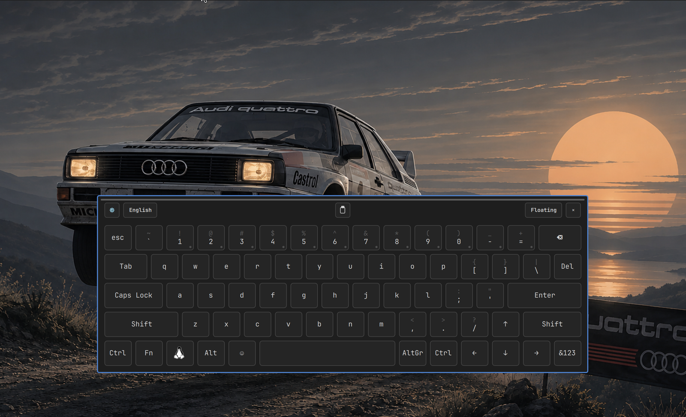
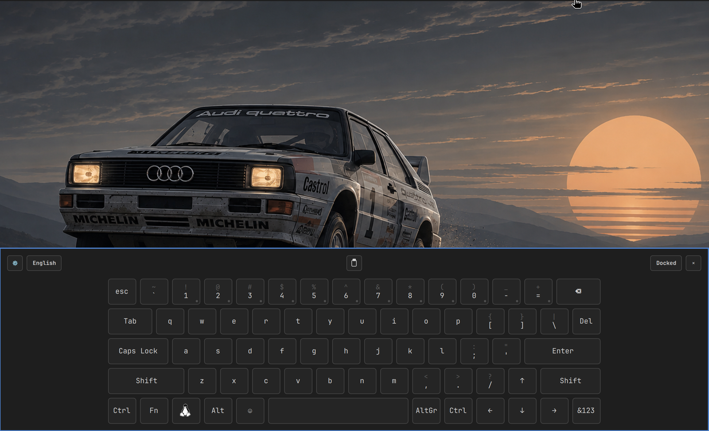
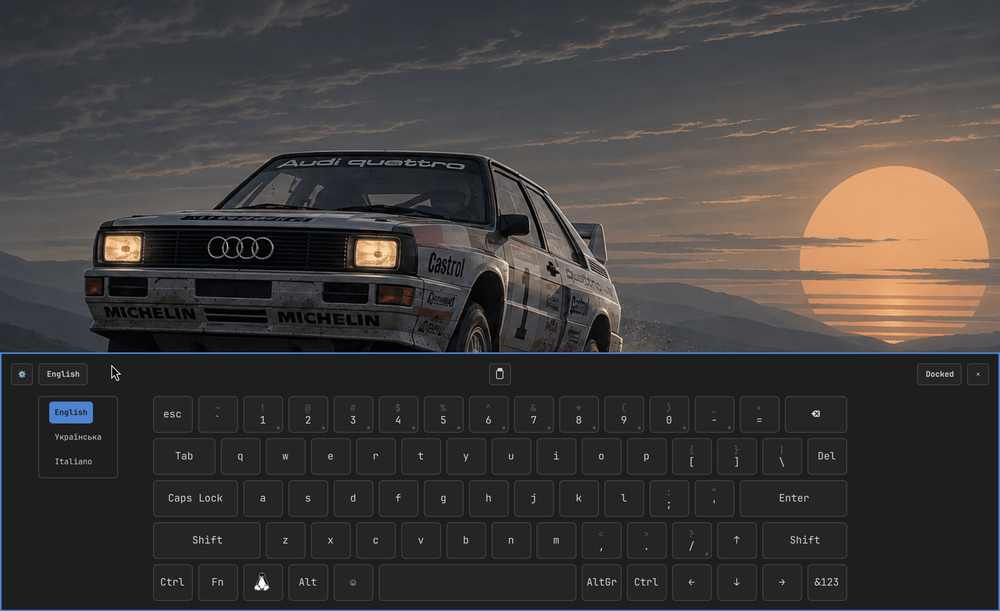
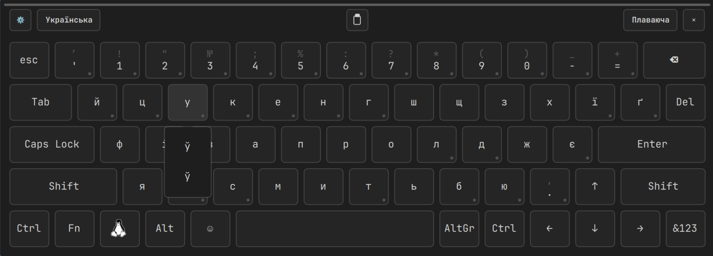
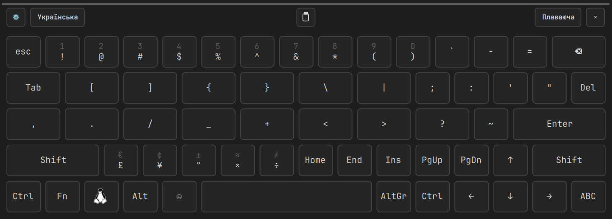
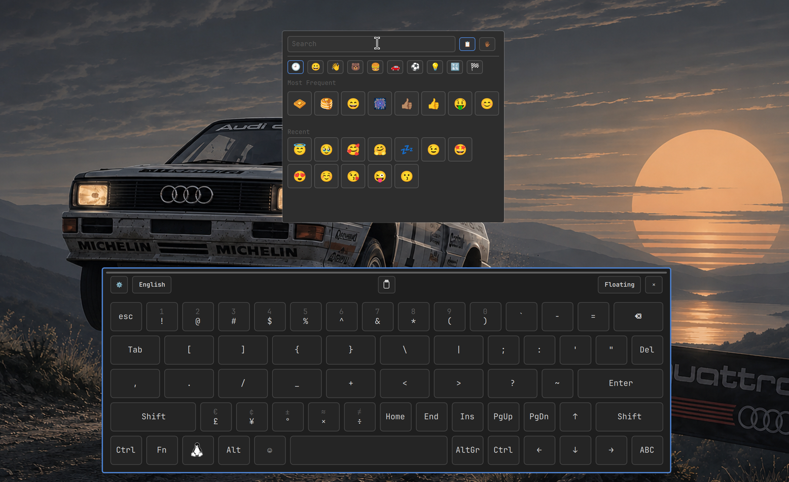
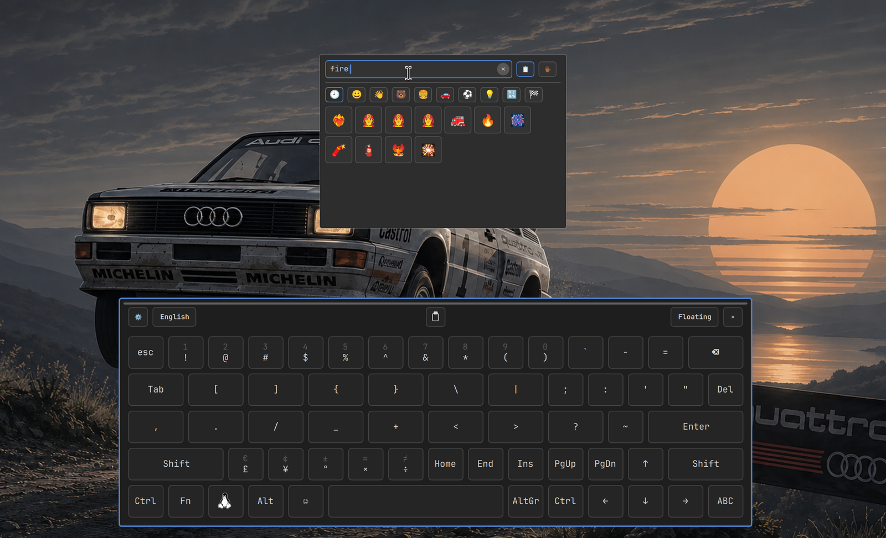
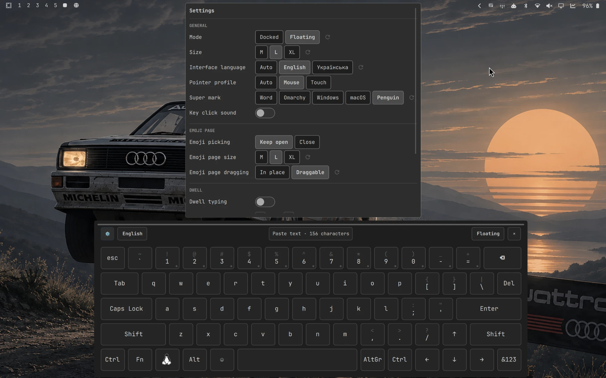
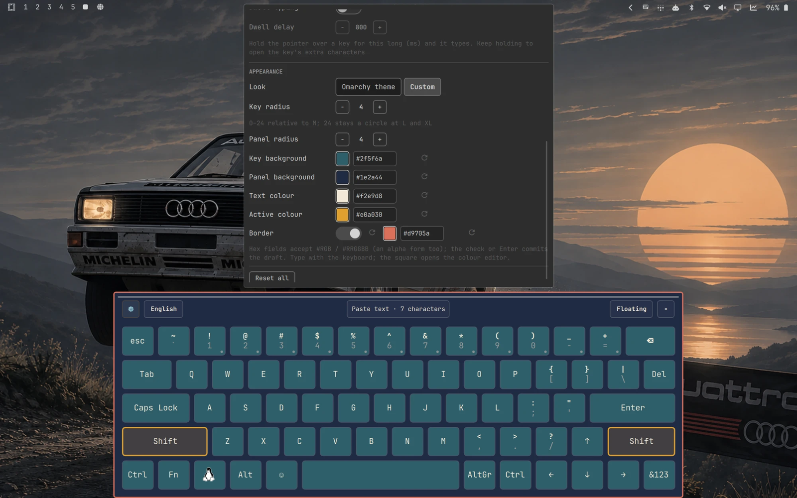

# OSKar — on-screen keyboard for Omarchy

OSKar (say it "OS-car", Оскар in Cyrillic) is a mouse-driven on-screen
keyboard for Omarchy Quattro. OSKar is not Oscar — no statuettes; it's
the OSK, ar. The key caps follow the active keyboard layout, so what is
drawn is what gets typed, and the panel takes its colours and geometry
from the Omarchy theme.

<p align="center">
  
</p>

## Screenshots

| | |
|---|---|
|  <br>**Docked** — flush along the bottom edge, full width |  <br>**Caps follow the seat** — Ukrainian drawn and named Українська |
|  <br>**Languages named in their own language** — English, Українська, Italiano; picking one moves the whole seat |  <br>**Hold a key** — its extra levels stack into a column (Ukrainian н: ŷ) |
|  <br>**?123 symbols** — currency and punctuation on every layout |  <br>**Emoji page** — categories, recents, the panel's own grid |
|  <br>**Emoji search** — type a query, pick from the matches |  <br>**Settings** — mode, size, interface language, input profile |
|  <br>**Appearance** — radius and colours, applied live | |

## Status

Alpha, daily-driven by its author on his own machine — that is how most
of it was found and fixed. **0.1.0 is the first release.** It installs
through Omarchy's plugin manager, from a source checkout, or from the
release with its `PKGBUILD` and a prebuilt helper (all below).
[CHANGELOG.md](CHANGELOG.md) lists what works; `docs/decisions.md`
explains why it works that way.

## Layout

| path | what it is |
|---|---|
| `manifest.json` | plugin manifest (`io.github.vladkarok.oskar`) |
| `Panel.qml` | the keyboard window: a docked full-width strip or a floating overlay |
| `Keyboard.qml` + the extracted seams (`HelperLink.qml`, `PasteChords.qml`, `HoldMenu.qml`) | key grid, layout tracking, reply dispatch, keycap pipeline; the socket client and paste chords live in their seams (§105–§106) |
| `KeyboardLayout.js` | key rows, keysym tables, xkb position mapping |
| `EmojiPage.qml`, `EmojiCatalog.js` | the panel's own emoji page over the keys; catalogue generated from vendored Unicode data (`third_party/emoji/`) |
| `ClipboardPaste.js` | the emoji delivery transaction (a failed pick puts the previous text back) and the paste chip's target rule (colour field, emoji search, external client) |
| `ChordAcks.js` | reply correlation: every command one queue slot, every reply pops it — the paste chord's verdict is its own final line's ack |
| `PasteFlow.js` | the paste lifecycle: busy-gate, dispatch region, ordered cancellation |
| `ShareQueue.js` | the keymap-share scheduler: one share run at a time, the pending generation consumed on success |
| `GapsNudge.js` | the docked relayout nudge: reads `general:gaps_out` in any form Hyprland answers, writes the exact value back |
| `LanguageControl.js` | the language control's shapes and the chooser's entries; languages named in their own language |
| `LayoutDevices.js` | which keyboard the panel reads its layout from, and which ones the language button moves |
| `SettleGuard.js` | the post-reconnect echo window: which uncommanded group flips to follow |
| `SeatMotion.js` | who moved on the seat over time: a keyboard toggled alone, told from a burst and from the panel's own click |
| `HoverTooltip.qml` | one shared hover tooltip for ambiguous icon controls |
| `ModifierReducer.js` | the modifier state machine (pure, tested) |
| `Config.js` | maintained defaults plus override/state validation and serialization |
| `Theme.qml` | the panel's one reader of Omarchy's shared style tokens |
| `BarWidget.qml` | bar icon that toggles the panel |
| `daemon/` | Rust helper holding one virtual keyboard |
| `tools/nested-session.sh` | runs a command against a throwaway nested Hyprland |
| `tools/smoke-daemon.sh` | end-to-end check of the helper |
| `tools/integration/` | the assertions that check runs, and their plumbing |
| `docs/orientation.md` | what this is and how the pieces fit — read first |
| `docs/decisions.md` | why the design looks like this, and the dead ends |
| `docs/vm-handoff.md` | the dogfooding VM: operating manual and queue |

## Modes and configuration

The panel has two geometries. **Docked** (the default on first run) sits
flush along the bottom edge at full width and reserves that space through
the layer-shell exclusive zone, so windows move up while it is open and
return when it closes — the way the Windows touch keyboard behaves. A
fullscreen window ignores exclusive zones and is overlaid instead. **Floating**
reserves nothing and is dragged by its bar. Mode is chosen in Settings.

Maintained defaults ship in `Config.js`. Deliberate user choices are sparse in
`$XDG_CONFIG_HOME/oskar/config.json`; floating geometry is separate in
`$XDG_STATE_HOME/oskar/state.json`. Both files reload on change without
polling and GUI writes replace them atomically. Invalid external text stays
untouched while the panel keeps the last valid runtime value.

| key | values | default |
|---|---|---|
| `mode` | `docked` \| `floating` | `docked` |
| `size_preset` | preset name | `medium` |
| `sound` | `true` \| `false` | `false` |
| `follow_theme` | `true` \| `false` | `true` |
| `emoji_close_after_pick` | `true` \| `false` | `false` |
| `emoji_drag` | `true` \| `false` | `false` — the page opens centred and still; on, it grows a drag strip and its position is remembered |
| `emoji_page_size` | `medium` \| `large` \| `x-large` | `medium` |
| `super_mark` | `word` \| `omarchy` \| `windows` \| `macos` \| `penguin` | `word` |
| `key_radius` | whole-pixel integer ≥ 0, 0–24 relative to M | `8` |
| `panel_radius` | whole-pixel integer ≥ 0 | `12` |
| `key_background` | hex colour (`#RGB`, `#RGBA`, `#RRGGBB`, `#AARRGGBB`) | `#303030` |
| `panel_background` | hex colour (`#RGB`, `#RGBA`, `#RRGGBB`, `#AARRGGBB`) | `#202020` |
| `text_color` | hex colour (`#RGB`, `#RGBA`, `#RRGGBB`, `#AARRGGBB`) | `#f5f5f5` |
| `accent_color` | hex colour (`#RGB`, `#RGBA`, `#RRGGBB`, `#AARRGGBB`) | `#7aa2f7` |
| `border_color` | hex colour (`#RGB`, `#RGBA`, `#RRGGBB`, `#AARRGGBB`) | `#5a5a5a` |

`state.json` contains the floating placement as `center` — the card centre in
output-local coordinates — or `null`, the emoji page's dragged position as
`emoji_center` (written when `emoji_drag` is on; kept across setting flips),
bounded emoji usage continuity, and the emoji skin-tone selection (state, not
an override).
Restores rederive
the top-left from that centre, clamped only enough to keep the complete card
on its output (the deterministic anchor of spec-v1.1 §4), so a saved
placement cannot jump near an edge when the preset or output changes. An
absent override follows the maintained value, so a later release can change
its default without rewriting the user's sparse file.

`sound: true` plays the freedesktop sound theme's `bell` event on each key
press through QtMultimedia — nothing is spawned per keystroke. It needs
`qt6-multimedia` and `ffmpeg`; the theme's Vorbis file is transcoded to PCM
once at startup (SoundEffect plays uncompressed WAV only), into
`$XDG_RUNTIME_DIR/oskar/keyclick.wav`. Without them the keyboard works and
stays silent.
Colours, fonts and corner radius all come from the shared Omarchy style tokens,
so switching the theme redraws the keyboard where it stands — no restart of the
shell or the plugin, and nothing on the typing path is touched. `follow_theme:
false` stops it tracking theme changes: the keyboard keeps the theme that was in
force when it was first opened. Each of the seven appearance fields in the table
above can also be pinned on its own — the settings popover's Appearance section,
or a sparse entry in `config.json`: an explicit override wins over the theme for
that field alone, with precedence override → live (or frozen) token → shipped
default, while every unpinned field keeps following or staying frozen as
`follow_theme` says. Overrides are the whole of the v1.1 appearance surface, not
an independent colour schema — that remains v2.

## Input profile (mouse and touch)

**Touch is beta.** OSKar's design centre is the mouse; the touch
profile is new and usable but not yet polished — expect small targets
in the emoji and settings chrome. It is opt-in: the default profile is
Mouse, and nothing switches until you choose Auto or Touch in Settings.

One setting, three values (**Mouse** by default; **Auto** or **Touch**
opt in):

- **Mouse** (the design centre): hover tooltips everywhere,
  dwell-to-type (rest on a cap and it types — the accessibility
  slice), hold-a-key column menus, press-typing with the compositor's
  own key repeat.
- **Touch** re-answers what a finger cannot do: a touch cannot hover,
  so dwell never arms and tooltips show on touch-and-hold
  (gear/close/paste) or stay hidden where a label already states the
  thing; fingers drift, so character caps **type on release** and
  sliding off cancels; long-press opens the same hold-column menus
  (the mobile idiom); chrome hit areas grow toward comfortable size
  where the geometry allows; Space/BackSpace keep press semantics, so
  holding BackSpace repeats exactly as on a hardware keyboard, and
  the close cap answers a release like every character cap.
- **Auto** observes the pointer's source: the first touch-drawn event
  switches to the touch affordances **for that summon** (a hidden
  panel forgets), and the settings row says `Auto (touch)` while it
  stands — the manual Mouse pin is the deliberate escape. One guard
  is absolute: with **dwell enabled, auto never flips** — a chosen
  access method is not disarmed by a stray touch.

Known rough edges, named: the emoji group tabs and settings segments
remain small targets; pen input is untested (a pen receives the touch
affordances); the observation is panel-wide — a touch on one monitor
switches the caps on all of them until the panel hides. Touch is
proven against an emulated multitouch device end to end (evdev →
libinput → the compositor's wl_touch) and Qt's own touch synthesis on
the shipping Qt version; real-finger hardware has not been in our
hands yet.

## Security posture

One sentence: OSKar is a **same-user** tool. What it keeps lives in
your `/run/user/<uid>/oskar/`, `~/.config/oskar/` and
`~/.local/state/oskar/`, plus the three installed files and the install
record listed below; a directory OSKar creates is `0700` and its files
`0600`, a directory that already exists keeps its mode, and parents such
as `~/.local/state` are created with your umask. The daemon runs as your
user without privileges, and the control socket is connectable only by
processes running as you — other users on the machine cannot inject
keystrokes or read your keymap.

Honest edges: root can do what root always can (no same-user tool
draws that line); the daemon trusts its same-user callers on a line
protocol (the same-user trust boundary is documented in
SECURITY.md; there is no network listener, no telemetry, no accounts — the
vision document calls the product a system utility and means it.

## What OSKar changes on your system

Everything OSKar changes outside its own directories, and what it puts
back. This list is the contract: a change that is not here is a bug.

- **Installed files.** A source install writes three files outside the
  checkout: the user unit `~/.config/systemd/user/oskar.service`, the
  helper `~/.local/libexec/oskar-daemon` and the command
  `~/.local/bin/oskar`, and lists them in
  `~/.local/state/oskar/install-record`. It replaces or removes only
  files that record lists unchanged (see Install). `oskar setup`
  registers the plugin under `~/.config/omarchy/plugins/` (a link to the
  checkout or the package's copy), enables it with `omarchy plugin
  enable`, and enables `oskar.service`, which adds systemd's link under
  `~/.config/systemd/user/`. The pacman package itself installs under
  `/usr` only.
- **Settings and state.** `~/.config/oskar/config.json` holds the
  settings you changed. `~/.local/state/oskar/state.json` holds the
  panel's placement, emoji usage, skin tone and last layout, and is
  written without any action of yours: after an emoji pick, when you
  move the panel or the emoji page, and when the helper acknowledges a
  layout group or names a keyboard the panel has not remembered yet. A
  directory OSKar creates is `0700`, each file `0600`; a directory that
  already exists keeps its mode, and its parents are created with your
  umask. A file that does not parse is never overwritten: the panel
  shows the error and keeps the last valid values. A file that is a
  symlink (a dotfile manager's) is written through: the link stays, and
  its target is replaced by a new file with mode `0600` (hard links to
  the old target no longer share it). Keys OSKar does not know are kept,
  up to 64 KiB of them; a file carrying more is treated as unparseable.
- **Runtime files.** `$XDG_RUNTIME_DIR/oskar/` holds the control socket,
  the keymap the helper publishes (`keymap.xkb`), the record of your own
  `kb_file` (`user-keymap-source`) and, with the click sound on,
  `keyclick.wav`. The directory goes away when your last session ends.
- **What the panel reads.** While the panel is open it reads the
  clipboard's type list and size on every change, for the paste chip,
  which shows only the kind and the number of characters ("Paste text ·
  24 characters"). The text itself is read only while you point at the
  paste chip (or hold it, on touch), shown in its tooltip and dropped when
  you move away; at the moment you paste into OSKar's own fields (the
  emoji search, a colour field); and during an emoji pick: once before
  publishing, to be able to put it back if the pick fails; up to five
  times to verify that its own publish landed; and, if the pick fails,
  once more to decide whether to put the previous text back. The text
  read before publishing is held only until the pick settles; what the
  other pick reads return is compared and not kept. Every read checks the type
  list before and after reading and discards the text if content is
  marked secret by a password manager (the `x-kde-passwordManagerHint`
  type) at either check; the chip then says "Hidden content" and still
  pastes it. Only content offered with that type is recognised as secret,
  and a secret that appears and is replaced again between the two checks
  of a single read could be read.
- **The clipboard.** An emoji pick goes through the clipboard: the emoji
  replaces what the clipboard held, and a delivered pick leaves it there.
  A pick that fails puts back what was there before, as plain text, only
  if it was text of up to 64 KiB that the pick could read and a read
  right before shows the clipboard still holds the pick; if anything else
  was copied during the pick, that stays. Known limit: something copied
  in the moment between that read and the put-back is replaced. An
  image, other non-text content, or content marked secret is not put
  back; the clipboard then keeps the emoji. The emoji
  page says that a pick replaces the clipboard. What OSKar puts on the
  clipboard stays there after the shell restarts or the plugin is
  disabled, until something else is copied. The **Copy** button of the
  "not installed" and "needs updating" notices writes the install command
  to the clipboard when you click it; that copy belongs to the shell and
  is gone when the shell exits.
- **`input:kb_file` (Hyprland, runtime only).** As soon as the shell
  loads the plugin and the helper answers — whether or not the panel is
  open — the panel asks the helper to point `input:kb_file` at its
  published keymap, so every keyboard on the seat compiles the keymap the
  helper types with. That keymap is your own (your layouts, or your own
  `kb_file`) with OSKar's reserved symbol block added on levels five to
  eight (the Level5 modifier) of the digit row `AE01`–`AE12`, then as
  needed of `AD11`, `AD12`, `AC10`, `AC11`, `AB08`–`AB10`, `TLDE`, `BKSL`
  and `LSGT`, and of `AB11` and `AE13` where your keymap leaves them
  free. A position is used only when your layouts put nothing above
  level four on it and it does not change with Lock, Control, Alt or
  Super; if any of your keys already reaches level five, only the free
  positions are used. Without the shared keymap, applications switch layout on
  every focus change (decisions §35). Your own `kb_file`, if you set one,
  is recorded verbatim, even when the file it names is missing. Your value
  (or none) is put back when the helper stops — `systemctl stop`, `oskar
  upgrade`, logout — and when the shell running the panel exits cleanly.
  A config reload (`hyprctl reload`, a theme change) also resets it to
  your config's value, and the panel then shares the keymap again. The
  helper does not take over a relative `kb_file`, because it could not
  put it back: the panel then shows that layout sync failed, and typing
  still works. Known limit: while OSKar runs, the global `kb_file` also
  applies to keyboards that have their own layout in a `device` section,
  so per-device keymaps are overridden.
- **`general:gaps_out` (Hyprland, docked mode only).** When the docked
  panel appears and when it closes, OSKar raises the first number of
  `gaps_out` by one and writes your exact value back about 60 ms later
  (plus four `hyprctl` calls), so Hyprland moves already-tiled windows
  around the panel. Every write is checked by reading the value back.
  It uses `hyprctl keyword`, which Omarchy's Lua config refuses: there
  it is a no-op. A value in a form OSKar does not recognise is left
  alone. If writing the value back fails twice, the journal names the
  original value. A shell killed inside that window leaves the first
  number one higher until a config reload.
- **`cursor:hide_on_key_press` (Hyprland, runtime only).** Turned off
  while the panel is open, so the pointer does not vanish while you
  click keys, and set back to your value when it closes. A config
  reload also restores it.
- **Layouts.** The panel's language button moves the keyboards OSKar
  positively identifies as physical and that share the reading
  keyboard's layout list, together, to the chosen layout.
- **Buttons that run something.** The dependency banner's **Install
  package** button opens a terminal that runs `omarchy pkg add hyprland`
  when you click it. **Retry** starts `oskar.service` through `oskar
  start`, which starts it only when the unit systemd resolves is
  OSKar's.
- **Not put back after a crash or `SIGKILL`.** If the helper is killed
  outright, it cannot put `kb_file` back: the compositor stays on the
  published keymap until a Hyprland reload or logout (or until a helper
  started later stops cleanly and puts your value back); typing keeps
  working because the published file persists. If the
  shell is killed while the panel is open, cursor hiding stays off until
  a config reload. A key the helper holds at the moment it is killed
  stays pressed for the application that has focus.

## Languages

One product, four languages, each with a job:

- **QML** (the Quickshell panel) — what the panel is and where it draws.
- **JavaScript** (twenty-three pure modules beside the QML, plus three
  generated emoji-data files) — every decision
  the panel makes: what each keycap types, which modifiers a
  hold-column pick needs, how the emoji search ranks, whether the panel
  follows a layout-group change. Pure, stateless, and covered by 580
  offscreen test cases — the repo's main regression net.
- **Rust** (the `oskar-daemon` helper) — everything at the seat: it
  compiles and mirrors the XKB keymap, owns the virtual keyboard, and
  speaks the versioned socket protocol. 85 unit tests.
- **Python and one C file** (`tools/integration/`) — not part of the
  product: the lab harness that drives a real panel with real pointer
  events inside a throwaway VM, and a tiny Wayland client that spies on
  keymap deliveries. Development-only.

## Why there is a helper at all

QML cannot drive `zwp_virtual_keyboard`, so typing has to go through a separate
process. The first version spawned `wtype` once per keystroke, which cost 37.8ms
a key (measured) and never reached XWayland clients, because `wtype` uploads a
small synthetic keymap that XWayland ignores — keystrokes vanished into Proton
games and Electron apps. A single long-lived helper with a complete keymap
brought that to 0.4ms average and does reach XWayland.

## How this compares

Surveyed September 2026. No other on-screen keyboard follows the system
layout; most ship their own layout lists that only their own key switches.

| | This keyboard | GNOME OSK | plasma-keyboard (6.6) | squeekboard / Stevia | wvkbd | onboard |
|---|---|---|---|---|---|---|
| Mouse-driven desktop use | yes — the design centre (a touch profile ships; see below) | touch activation only | touch-first (mouse use still a known gap) | touch-first | touch-first | yes (its niche) |
| Caps follow the system layout | both directions — switch with the physical shortcut and the caps follow; switch from the panel and the physical keyboard follows | partial, one-way, ibus-coupled | Qt Virtual Keyboard's own layout lists | its own layout files | static keycap sets | own definitions |
| What is drawn is what is typed | yes, including non-Latin and per-group variants, proven byte-exact | within GNOME's input stack | within Qt's stack | within Phosh | — | X11 only |
| XWayland / wine-Proton | proven (paced paste chord) | — | — | — | types, no layout coupling | X11 only |
| Chromium/Electron emoji | proven (byte-exact clipboard transaction — the one channel every pick uses) | — | — | — | — | — |
| Host | Omarchy (Hyprland + Quickshell), Wayland | GNOME (mutter/ibus) | Plasma 6.6+, input-method-v1 | Phosh | wlroots mobile shells | X11 |
| State (2026) | active | active | new (Feb 2026) | squeekboard replaced by Stevia in postmarketOS | active | abandoned |

Notes from the survey:

- **wvkbd** types through the same virtual-keyboard protocol but ships
  static keycap sets switched only by its own key, and its auto-show
  occupies the single input-method slot.
- **plasma-keyboard** wraps Qt Virtual Keyboard and rides
  input-method-v1 — a protocol Hyprland does not implement — and
  **maliit**, the previous Plasma option, spoke the same one.
- **IME/text-input routes** (fcitx5, maliit, GNOME apps) never reach
  XWayland, which is a hard requirement here, and would fight Caps-Lock
  layout toggles with a second layout state.
- **GNOME Shell's OSK** is the proof the design is right — a
  compositor-owned virtual device over one system-wide input source —
  but it is welded to mutter/ibus. **Sway** already has the
  compositor-side fix (same-keymap devices share layout state, switches
  skip virtual keyboards); that is the model for the eventual Hyprland
  upstream work.

## Compatibility

- **Desktop**: Omarchy (tested against Omarchy 4.0.x with its own
  `omarchy`/`omarchy-dev` packages; the shell's plugin surface is a
  moving target — current as of Quickshell 0.3.1 and Hyprland 0.56.2,
  both pinned by nothing more than Omarchy's own versions). Wayland
  only; there is no Xorg, GNOME or KDE host, and GTK/KDE portability is
  explicitly post-release.
- **Typed-into consumers, verified**: native Wayland clients (foot),
  XWayland windows (wine/Proton get the paced plain Ctrl+V paste), and
  Chromium-family editors (Electron receives supplementary-plane emoji
  byte-exact through the clipboard transaction — the one channel, §91).
  Other toolkits are
  untested.
- **Language coupling**: any number of configured XKB layouts; typing
  and the caps follow the compositor's layout state in both directions.
  The UI ships in English, Russian and Ukrainian, following the active
  layout (a settings override pins one); the emoji search understands
  English, Russian and Ukrainian keywords.
- **Not tested**: real-hardware sleep/wake (the lab VM cannot suspend);
  real touchscreen hardware (the touch profile is emulator- and
  Qt-synthesis-proven; see Input profile below).

## Known problems

1. ~~**The helper's keymap becomes the seat's.**~~ **Closed by design.** Hyprland
   re-points the seat at the typing device before forwarding input, but a client
   is only told about a keymap change when the bytes differ
   (`CWLKeyboardResource::sendKeymap`, `src/protocols/core/Seat.cpp`). The helper
   compiles the identical RMLVO the compositor uses, so switching between the
   physical keyboard and the helper is invisible to clients. The churn storm that
   motivated this (56 rebuilds a minute, 56,547 in five minutes once it fed back)
   only happened because the old keymaps differed. Remaining work is proof, not
   design: the nested-session harness bounds compositor rebuilds by threshold,
   and the claim still needs daily-use confirmation.
2. ~~**The compiled keymap is incomplete.**~~ **Closed.** The `configure` command
   carries rules, model, layouts, variants, options and a keymap file, and the
   panel sends it with the full set read from the compositor.
3. **Device selection is imperfect.** The helper serves the seat's facts
   over its socket — every keyboard with its layouts and live group, which
   devices it positively identifies as physical, and a pushed event whenever
   a keyboard's group moves or the device set changes — and the panel reads
   layouts from the most convincing typed keyboard among them: the
   compositor's active-keyboard flag (`main`, the seat's current keyboard) if
   a filtered device holds it; else a filtered keyboard that moved by itself
   (a toggle such as Alt+Shift moves only the keyboard it was pressed on:
   one keyboard moved, nothing else moved within 150 ms of it, and the
   panel's own click did not move it); else the keyboard learned that way
   before; else layout progress. That second tier is what keeps the caps
   right when an input method such as fcitx5 holds `main` for good. With no
   positive evidence the language button does nothing rather than guess.
   What remains, in plain words:
   - With two real keyboards, the caps show the group of the keyboard you
     toggled last. Typing on the other one types its own group, which may
     differ, until you press the language button: it moves both keyboards to
     one group.
   - Two keyboards toggled within the same instant (150 ms) read as one
     burst; the panel then falls back to the group it remembers.
   - A keyboard holding the compositor's current-keyboard flag outranks a
     keyboard that moved by itself.
   - A script that moves one idle keyboard alone is followed as if you had
     switched on it.
   - A toggle made in the first ten seconds after the helper restarts (the
     settle window) is not learned unless the panel already reads that
     keyboard; the next toggle is.
   - Hotplug and mouse media keys can move the flag until the next physical
     keypress, and tied-at-zero devices are assumed to share the seat's
     RMLVO.

   The root cause is upstream: layout state lives per device (including
   power buttons and gaming mice), and nothing announces a change of the
   seat's current keyboard. An upstream discussion with Sway's
   keyboard-group semantics as prior art is planned.
4. ~~**Held keys are tracked per connection**~~ **Closed.** The device is
   shared, so held keys carry per-connection claims: the press belongs to the
   first claim, the release to the last, a release from a connection that
   never claimed the code is refused, a tap cannot lift another connection's
   hold, and a disconnect releases only that connection's claims (smoke
   covered, including two clients sharing one hold).

5. ~~**Multi-monitor summon flash.**~~ **Closed.** The panel's windows map
   only once the summon has resolved the pointer's output, so the first
   frame is on the right monitor; a probe that never answers shows the
   panel where it was after a short fallback. The lab's summon-output leg
   pins it with a headless second output.

## Troubleshooting

Run `oskar doctor` — it checks the service, socket and protocol,
registration, the keymap share, keycap-fallback journal lines, layouts
and theme dependencies, and names the one fix to try for each failure
(exit 0 is healthy).

## Testing

Never exercise the helper against the session you are working in. A keymap
feedback loop in an earlier version drove xkbcomp 56,547 times in five minutes
and froze the desktop hard enough to require a TTY switch.

```sh
tools/nested-session.sh ./daemon/target/release/oskar-daemon
tools/nested-session.sh tools/smoke-daemon.sh
```

The harness starts a disposable nested Hyprland, gives the subject a private
`XDG_RUNTIME_DIR` so its control socket cannot collide with an installed
service, and fails the run if compositor keymap rebuilds exceed a threshold.

`tools/smoke-daemon.sh` owns the helper process; the assertions live in
`tools/integration/suite.py` and everything that talks to the socket, the
log or `hyprctl` lives in `tools/integration/harness.py`, so a new check is
a new `@test` and nothing else. The script waits for the control socket to
appear; the suite then bounds the compositor's keymap rebuilds by a ceiling
derived from the seat identities the run installs (a byte-identical
`configure` must short-circuit; the derivation lives in
`tools/nested-session.sh`), checks that the device's group
follows `configure`/`group` commands with an assertion before every tap
(read back from `hyprctl devices`), that a client disconnecting mid-chord
leaves the helper serving, and the multi-client claim rules (foreign
releases refused, a shared press surviving one claim's release, taps
refusing to lift a claim, a re-claim after a keymap swap re-pressing). VM
integration legs verify the protocol and keymap seams; every emoji pick
is delivered by the clipboard transaction (§91 — the typed delivery
routes are gone), whose helper ack proves the chord reached the
compositor, not that the destination consumed the paste — that residual
is stated in decisions §107. Visual feel and real-host application
behavior remain owner-acceptance work.

```sh
cd daemon && cargo test
```

## Install

OSKar needs Omarchy (its shell hosts the panel) and, for the helper,
either a Rust toolchain to build it once (`omarchy pkg add rust`) or the
prebuilt helper from the release page (see below).

### With Omarchy's plugin manager

```sh
omarchy plugin add https://github.com/Vladkarok/oskar --enable
bash ~/.config/omarchy/plugins/io.github.vladkarok.oskar/install.sh
omarchy restart shell
```

The first command puts the keyboard's icon in the bar. Until the helper is
installed the panel says `oskar.service is not installed`, and its **Copy**
button hands over the second command. `install.sh` builds the helper,
installs it with its user unit and the `oskar` command, and starts it.

To update: `omarchy plugin update io.github.vladkarok.oskar`, then rerun
`install.sh`, or `oskar upgrade`, the same rerun (a panel newer than its
helper says it needs updating, and its Copy button hands over the command
that reinstalls it). To remove everything but your settings:

```sh
bash ~/.config/omarchy/plugins/io.github.vladkarok.oskar/uninstall.sh
omarchy plugin remove io.github.vladkarok.oskar
```

`uninstall.sh` removes only the files the install record proves
unchanged, and keeps the helper while a unit you edited still runs it, so
no enabled service is left pointing at a missing program. `uninstall.sh
--force` finishes anyway by moving the files that do not match the
record aside under a dated name; it deletes nothing of yours.

### From a source checkout

```sh
git clone https://github.com/Vladkarok/oskar.git oskar && cd oskar
./install.sh           # builds the helper, installs it + its unit + the
                       # oskar command, enables and starts the service
oskar setup            # registers the checkout under the stable plugin id,
                       # enables the plugin in Omarchy, re-checks the service
omarchy restart shell  # the running shell only picks up a newly registered
                       # plugin at restart (or log out and back in)
```

After updating the checkout, rerun `./install.sh` (or `oskar upgrade`, the
same rerun under one name): the panel and the helper share a protocol
version, and a panel updated without its helper says so rather than
typing nothing.

### From a release, with pacman

Each release carries a `PKGBUILD`: download it with the release tarball,
run `makepkg -si`, then `oskar setup` and `omarchy restart shell`. The
package installs files only; `oskar setup` activates them. An AUR package
follows when AUR account registration reopens.

### Without a Rust toolchain

Each release also carries `oskar-daemon-<version>-x86_64.tar.gz` (the
helper, its unit and the `oskar` command) with a `.sha256` beside it.
Any `install.sh` above takes it in place of the build:

```sh
bash install.sh --prebuilt ~/Downloads/oskar-daemon-0.1.0-x86_64.tar.gz
```

`install.sh` writes three files outside the checkout: the user unit
`~/.config/systemd/user/oskar.service`, the helper
`~/.local/libexec/oskar-daemon` and the command `~/.local/bin/oskar`.
It notes what it wrote in an install record
(`~/.local/state/oskar/install-record`). OSKar replaces or removes one
of these files only when the record lists it and it is unchanged since
OSKar wrote it, so a file you edited or one that belongs to something
else stays as it is. If the install finds such a file, it stops and
names it. `--force` moves it aside under a dated name and then
installs; nothing is deleted. An install made by an OSKar version older
than the install record has no record yet, so it needs `--force` once.
Another checkout's install is taken over without it. `uninstall.sh` and
`oskar setup --migrate-source` follow the same rule, and `oskar` starts,
restarts, enables or stops `oskar.service` only when the unit systemd
runs is the oskar package's or the recorded one. Switching it off removes
only the enablement links that point at OSKar's own unit, and
`install.sh` will not shadow another program's `oskar.service` without
`--force`.

A tarball placed beside `install.sh` is picked up without the flag, and
`oskar setup --prebuilt <tarball>` / `oskar upgrade --prebuilt <tarball>`
thread it through the lifecycle command. Without cargo and without a
tarball, a rerun keeps the helper already installed and says how to
update it. The version in the file name must match the plugin's; a
mismatch is warned about, and the panel says so if the two speak
different protocols.

The panel can be toggled from a keybinding too:

```sh
omarchy-shell shell toggle io.github.vladkarok.oskar
```

`oskar setup` is idempotent and also owns `status` and `teardown`
(full removal: registration, plugin enable, unit, state). For reference,
the manual equivalent of `install.sh`:

```sh
cd daemon && cargo build --release
install -Dm755 target/release/oskar-daemon ~/.local/libexec/oskar-daemon
install -Dm644 ../systemd/oskar.service ~/.config/systemd/user/oskar.service
systemctl --user daemon-reload
systemctl --user enable oskar.service
systemctl --user --quiet is-active graphical-session.target \
  && systemctl --user restart oskar.service
```

The panel alone can be enabled with `omarchy plugin enable io.github.vladkarok.oskar`.
